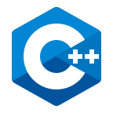

# Hello!

### About me
Software Engineering Student at Inatel and Software Development intern at Embraer.

  

  

### 🚀 Languages and Tools  

  
  
  
  
  
  
  
  
  
  
  
  
  
  
  
  
  
  

